<center><h1>modèle de prédiction du défaut de prêt</h1></center>
<div id="a6aa9a98-a822-4f11-a652-9d54ec6a3d49" class="cell code"
markdown="1" execution_count="67">

``` python
# importation des modules necessaire
import pandas as pd
import numpy as np
import matplotlib.pyplot as plt
import seaborn as sns
import math
from sklearn.model_selection import train_test_split
from sklearn.linear_model import LogisticRegression
from sklearn.metrics import accuracy_score, classification_report
from sklearn.ensemble import RandomForestClassifier
from sklearn.tree import DecisionTreeClassifier
import warnings
warnings.filterwarnings('ignore')
```

</div>

<div id="53ad0a8a-2c8c-4ffd-874c-aa86105a086d" class="cell markdown"
markdown="1">

### Comprehension des donnees

</div>

<div id="2da0e7ff-a31b-4f27-b532-f730edf6dcb3" class="cell code"
markdown="1" execution_count="68">

``` python
#importation du dataset
data = pd.read_csv("Loan_Default.csv")
```

</div>

<div id="a4681a3b-dbc5-4244-ba33-58afaebcc3d4" class="cell code"
markdown="1" execution_count="69">

``` python
# premiere visualisation du haut de la dataset
data.head()
```

<div class="output execute_result" markdown="1" execution_count="69">

           LoanID  Age  Income  LoanAmount  CreditScore  MonthsEmployed  \
    0  I38PQUQS96   56   85994       50587          520              80   
    1  HPSK72WA7R   69   50432      124440          458              15   
    2  C1OZ6DPJ8Y   46   84208      129188          451              26   
    3  V2KKSFM3UN   32   31713       44799          743               0   
    4  EY08JDHTZP   60   20437        9139          633               8   

       NumCreditLines  InterestRate  LoanTerm  DTIRatio    Education  \
    0               4         15.23        36      0.44   Bachelor's   
    1               1          4.81        60      0.68     Master's   
    2               3         21.17        24      0.31     Master's   
    3               3          7.07        24      0.23  High School   
    4               4          6.51        48      0.73   Bachelor's   

      EmploymentType MaritalStatus HasMortgage HasDependents LoanPurpose  \
    0      Full-time      Divorced         Yes           Yes       Other   
    1      Full-time       Married          No            No       Other   
    2     Unemployed      Divorced         Yes           Yes        Auto   
    3      Full-time       Married          No            No    Business   
    4     Unemployed      Divorced          No           Yes        Auto   

      HasCoSigner  Default  
    0         Yes        0  
    1         Yes        0  
    2          No        1  
    3          No        0  
    4          No        0  

</div>

</div>

<div id="c4ec2a42" class="cell code" markdown="1" execution_count="70">

``` python
# Quantitative variables:
data.describe().T
```

<div class="output execute_result" markdown="1" execution_count="70">

                       count           mean           std      min       25%  \
    Age             255347.0      43.498306     14.990258     18.0     31.00   
    Income          255347.0   82499.304597  38963.013729  15000.0  48825.50   
    LoanAmount      255347.0  127578.865512  70840.706142   5000.0  66156.00   
    CreditScore     255347.0     574.264346    158.903867    300.0    437.00   
    MonthsEmployed  255347.0      59.541976     34.643376      0.0     30.00   
    NumCreditLines  255347.0       2.501036      1.117018      1.0      2.00   
    InterestRate    255347.0      13.492773      6.636443      2.0      7.77   
    LoanTerm        255347.0      36.025894     16.969330     12.0     24.00   
    DTIRatio        255347.0       0.500212      0.230917      0.1      0.30   
    Default         255347.0       0.116128      0.320379      0.0      0.00   

                          50%        75%       max  
    Age                 43.00      56.00      69.0  
    Income           82466.00  116219.00  149999.0  
    LoanAmount      127556.00  188985.00  249999.0  
    CreditScore        574.00     712.00     849.0  
    MonthsEmployed      60.00      90.00     119.0  
    NumCreditLines       2.00       3.00       4.0  
    InterestRate        13.46      19.25      25.0  
    LoanTerm            36.00      48.00      60.0  
    DTIRatio             0.50       0.70       0.9  
    Default              0.00       0.00       1.0  

</div>

</div>

<div id="b7815bee-8e04-47ad-b55f-0594a1c9ab7a" class="cell code"
markdown="1" execution_count="71">

``` python
categorical_columns = data.select_dtypes(include='object').columns

categorical_columns = [col for col in categorical_columns if col != 'LoanID']

summary_dict = {}

for column in categorical_columns:
    categories = data[column].value_counts().index.tolist()
    summary_dict[column] = categories

for column, category_values in summary_dict.items():
    print(f"{column}: {category_values}")
```

<div class="output stream stdout" markdown="1">

    Education: ["Bachelor's", 'High School', "Master's", 'PhD']
    EmploymentType: ['Part-time', 'Unemployed', 'Self-employed', 'Full-time']
    MaritalStatus: ['Married', 'Divorced', 'Single']
    HasMortgage: ['Yes', 'No']
    HasDependents: ['Yes', 'No']
    LoanPurpose: ['Business', 'Home', 'Education', 'Other', 'Auto']
    HasCoSigner: ['Yes', 'No']

</div>

</div>

<div id="bb13323d-e239-4a9e-9bcc-2b30e067d26e" class="cell code"
markdown="1" execution_count="72">

``` python
# information sur la dimention du dataset
data.shape
```

<div class="output execute_result" markdown="1" execution_count="72">

    (255347, 18)

</div>

</div>

<div id="b0b8cf77-0b89-4db9-8eee-19a822e4e8bc" class="cell markdown"
markdown="1">

##### We have 255347 rows and 18 columns in our dataset and

</div>

<div id="d02a2018" class="cell code" markdown="1" execution_count="73">

``` python
# information sur le dataset
data.info()
```

<div class="output stream stdout" markdown="1">

    <class 'pandas.core.frame.DataFrame'>
    RangeIndex: 255347 entries, 0 to 255346
    Data columns (total 18 columns):
     #   Column          Non-Null Count   Dtype  
    ---  ------          --------------   -----  
     0   LoanID          255347 non-null  object 
     1   Age             255347 non-null  int64  
     2   Income          255347 non-null  int64  
     3   LoanAmount      255347 non-null  int64  
     4   CreditScore     255347 non-null  int64  
     5   MonthsEmployed  255347 non-null  int64  
     6   NumCreditLines  255347 non-null  int64  
     7   InterestRate    255347 non-null  float64
     8   LoanTerm        255347 non-null  int64  
     9   DTIRatio        255347 non-null  float64
     10  Education       255347 non-null  object 
     11  EmploymentType  255347 non-null  object 
     12  MaritalStatus   255347 non-null  object 
     13  HasMortgage     255347 non-null  object 
     14  HasDependents   255347 non-null  object 
     15  LoanPurpose     255347 non-null  object 
     16  HasCoSigner     255347 non-null  object 
     17  Default         255347 non-null  int64  
    dtypes: float64(2), int64(8), object(8)
    memory usage: 35.1+ MB

</div>

</div>

<div id="15d8bfe6" class="cell markdown" markdown="1">

### Description des variables

| Variable       | Description                                          | Type    |
|------------------------|------------------------|------------------------|
| LoanID         | Identifiant unique du prêt                           | Object  |
| Age            | Âge de l'emprunteur                                  | Int64   |
| Income         | Revenu annuel de l'emprunteur                        | Int64   |
| LoanAmount     | Montant du prêt demandé                              | Int64   |
| CreditScore    | Cote de crédit de l'emprunteur                       | Int64   |
| MonthsEmployed | Nombre de mois d'emploi actuel                       | Int64   |
| NumCreditLines | Nombre de lignes de crédit détenues                  | Int64   |
| InterestRate   | Taux d'intérêt du prêt                               | Float64 |
| LoanTerm       | Durée du prêt en mois                                | Int64   |
| DTIRatio       | Ratio dette/revenu de l'emprunteur                   | Float64 |
| Education      | Niveau d'éducation de l'emprunteur                   | Object  |
| EmploymentType | Type d'emploi de l'emprunteur                        | Object  |
| MaritalStatus  | Statut matrimonial de l'emprunteur                   | Object  |
| HasMortgage    | Indicateur de prêt hypothécaire                      | Object  |
| HasDependents  | Indicateur de personnes à charge                     | Object  |
| LoanPurpose    | Objectif du prêt                                     | Object  |
| HasCoSigner    | Indicateur de co-emprunteur                          | Object  |
| Default        | Indicateur de défaut de paiement (1 si oui, 0 sinon) | Int64   |

#### We can see there are three formats of data types:

object: Object format means variables are categorical. Categorical
variables in our dataset are"MaritalStatus", "HasMortgage",
"HasDependents", "LoanPurpose", "HasCoSigner"tus int64: It represents
the integer variables. ApplicantIncome is of this format. float64: It
represents the variable that has some decimal values involved. They are
also numerical variables. Numerical variables in our dataset'Age',
'Income', 'LoanAmount', 'CreditScore', 'InterestRate','DTIRatio'ataset.

</div>

<div id="c5e36043-f902-4d5d-8430-10a3ae7dd39b" class="cell markdown"
markdown="1">

# I. Analyse exploratoire des données (AED) [i-analyse-exploratoire-des-données-aed]

</div>

<div id="b919ed30" class="cell markdown" markdown="1">

## a) Visualisation des données

</div>

<div id="ad0bca3d-f420-48d4-94a5-b1082f59de70" class="cell markdown"
markdown="1">

### La dispertion des donnees numeriques

</div>

<div id="236a0ee2" class="cell code" markdown="1" execution_count="74">

``` python
sns.set(style="whitegrid")
numVariables = ['Age', 'Income', 'LoanAmount', 'CreditScore', 'InterestRate','DTIRatio']

plt.figure(figsize=(15, 8))
for i, var in enumerate(numVariables):
    plt.subplot(3, 4, i+1)
    sns.histplot(data[var], bins=30, kde=True)
    plt.title(f"{var} Distribution")

plt.tight_layout()
plt.show()
```

<div class="output display_data" markdown="1">

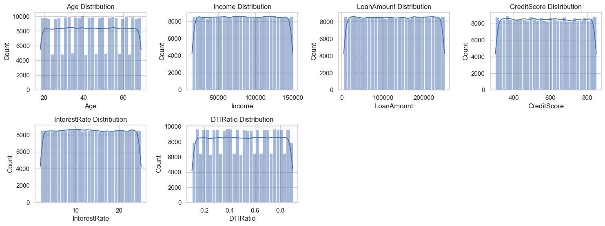

</div>

</div>

<div id="4143fae3" class="cell markdown" markdown="1">

#### La répartition de l'âge

dans l'ensemble des données suit une distribution normale, avec une
fréquence plus élevée d'individus dans la tranche d'âge moyenne. Les
individus plus jeunes et plus âgés ont des fréquences inférieures à
celles du groupe d'âge moyen.

#### La répartition des revenus

dans l'ensemble des données suit une distribution normale, avec une
fréquence plus élevée d'individus dans les tranches de revenus
inférieures et moyennes. Les individus ayant des revenus plus élevés ont
des fréquences plus faibles, ce qui indique qu'ils sont moins fréquents
dans l'ensemble de données.

#### La distribution du montant du prêt

dans l'ensemble de données suit une distribution normale, avec une
fréquence plus élevée de personnes demandant des montants de prêt plus
faibles. Au fur et à mesure que le montant du prêt augmente, la
fréquence des personnes diminue, ce qui indique que les prêts d'un
montant plus élevé sont moins fréquents dans l'ensemble de données.

#### La distribution du CreditScore

dans l'ensemble de données suit une distribution normale, avec une
fréquence plus élevée d'individus ayant des scores de crédit dans une
certaine fourchette. Lorsque le score de crédit s'écarte de cette
fourchette, la fréquence diminue, ce qui indique que les scores de
crédit extrêmes sont moins fréquents dans l'ensemble de données.

#### La distribution du taux d'intérêt

dans l'ensemble des données suit une distribution normale, avec une
fréquence plus élevée d'individus ayant des taux d'intérêt dans une
certaine fourchette. Lorsque le taux d'intérêt s'écarte de cette
fourchette, la fréquence diminue, ce qui indique que les taux d'intérêt
extrêmes sont moins fréquents dans l'ensemble de données.

#### La distribution du ratio dette/revenu (DTIRatio)

dans l'ensemble de données suit une distribution normale, avec une
fréquence plus élevée d'individus ayant des DTIRatios dans une certaine
fourchette. Lorsque le rapport DTI s'écarte de cette fourchette, la
fréquence diminue, ce qui indique que les rapports DTI extrêmes sont
moins fréquents dans l'ensemble de données. 22

</div>

<div id="2c425bbe-1937-4108-894f-bcf05179effd" class="cell markdown"
markdown="1">

### La dispertion des donnees categoriel

</div>

<div id="64718d74" class="cell code" markdown="1" execution_count="75">

``` python
sns.set(style="whitegrid")

categorical_variables = ['Education', 'MaritalStatus', 'EmploymentType', 'HasMortgage', 'HasDependents', 'LoanPurpose', 'HasCoSigner']

num_variables = len(categorical_variables)
num_rows = int(math.ceil(num_variables / 2))
num_cols = 2

fig, axes = plt.subplots(num_rows, num_cols, figsize=(12, 8))

axes = axes.flatten()

for i, variable in enumerate(categorical_variables):
    
    row_position = i // num_cols
    col_position = i % num_cols
    
    
    counts = data[variable].value_counts()
    
    axes[i].pie(counts, labels=counts.index, autopct='%1.1f%%', startangle=90)
    axes[i].axis('equal')  
    axes[i].set_title(f'{variable} Distribution')


plt.tight_layout()
plt.show()
```

<div class="output display_data" markdown="1">

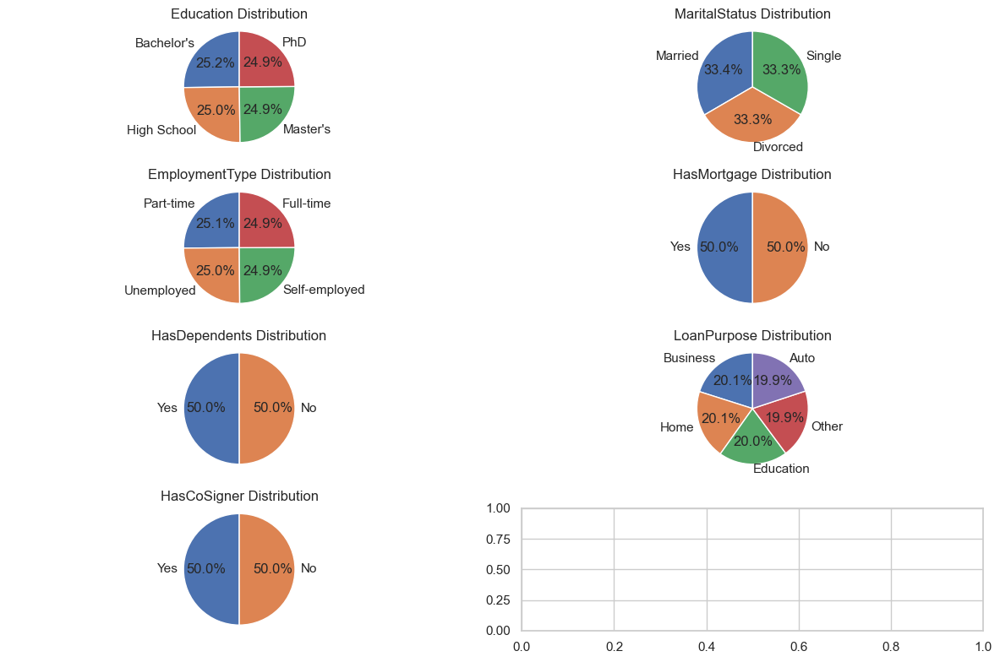

</div>

</div>

<div id="30956a62-30cf-40df-a0ee-4ed14ee8e00e" class="cell markdown"
markdown="1">

#### Le graph permet d'observer les éléments suivants : [le-graph-permet-dobserver-les-éléments-suivants-]

1.  Une part importante de la population a fait des études supérieures,
    et un grand nombre d'entre elle est titulaire d'un diplôme de haut
    niveau (master ou doctorat).
2.  La majorité des individus sont des travailleurs indépendants, soit
    50 % de la population.
3.  La répartition de l'état civil est relativement équilibrée, aucune
    catégorie ne dominant les autres.

</div>

<div id="f2da7130-1234-4ad1-9376-5e37ff927e89" class="cell markdown"
markdown="1">

### Identification des relations entre les variables et la variable cibles

</div>

<div id="d3a62a07" class="cell code" markdown="1" execution_count="76">

``` python
categorical_vars = ["MaritalStatus", "HasMortgage", "HasDependents", "LoanPurpose", "HasCoSigner"]
plt.figure(figsize=(15, 8))
for i, var in enumerate(categorical_vars, 1):
    plt.subplot(2, 3, i)
    sns.countplot(x=var, data=data, hue="Default", palette="viridis")
    plt.title(f"{var} Count Plot")

plt.tight_layout()
plt.show()
```

<div class="output display_data" markdown="1">

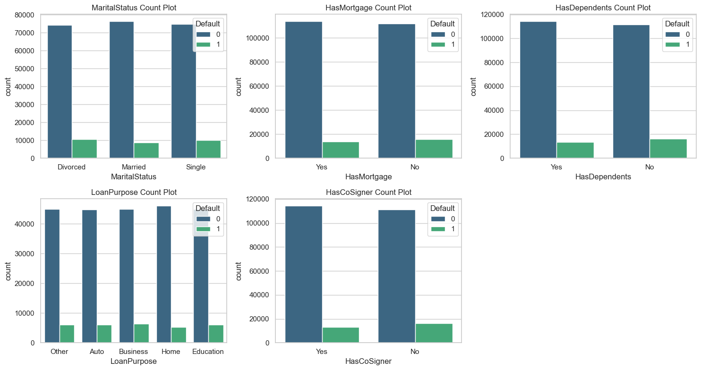

</div>

</div>

<div id="426e65f3" class="cell markdown" markdown="1">

#### Loan Purpose

On peut en déduire que la proportion (Other, Auto,
Business,Home,Education) est plus ou moins la même pour les prêts
approuvés et non approuvés.

#### Has Dependents

On peut en déduire que la proportion (Yes, No) est plus ou moins la même
pour les prêts approuvés et non approuvés.

#### Has CoSinger

On peut en déduire que la proportion (Yes, No) est plus ou moins la même
pour les prêts approuvés et non approuvés.

#### Has Mortgage

On peut en déduire que la proportion (Yes, No) est plus ou moins la même
pour les prêts approuvés et non approuvés.

</div>

<div id="34971ec4" class="cell code" markdown="1" execution_count="77">

``` python
counts = data["EmploymentType"].value_counts()

counts = data.groupby(["EmploymentType", "Default"]).size().unstack(fill_value=0)
counts.plot(kind="bar", stacked=True)
plt.xlabel("Employment Type")
plt.ylabel("Count")
plt.title("Employment Type Distribution by Loan Status")
plt.legend(title="Loan Status")
plt.show()
```

<div class="output display_data" markdown="1">

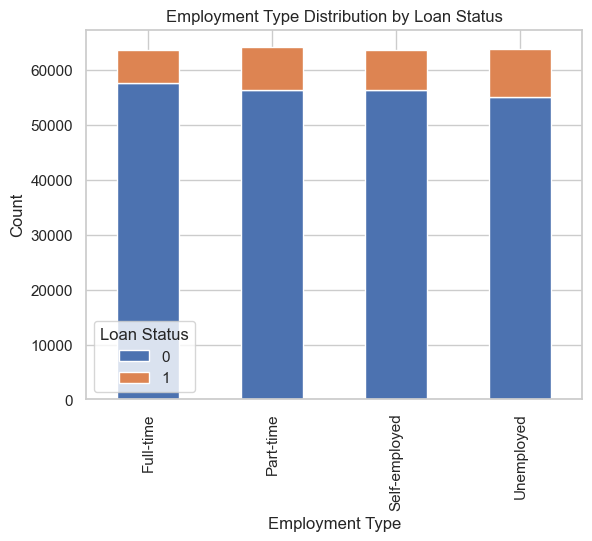

</div>

</div>

<div id="a1ff5080-3bd4-483f-bbe7-1cbd461fa797" class="cell markdown"
markdown="1">

#### Statut du pret par Type d'emploi

Nous pouvons constater que la proportion de prêts approuvés pour par
type d'emploi du demandeur est preseque le meme par rapport proportion
de prêts refusés

</div>

<div id="00099846" class="cell code" markdown="1" execution_count="78">

``` python
counts = data["LoanPurpose"].value_counts()

counts = data.groupby(["LoanPurpose", "Default"]).size().unstack(fill_value=0)
counts.plot(kind="bar", stacked=True)
plt.xlabel("loan Purpose")
plt.ylabel("Count")
plt.title("loan Purpose Distribution by Loan Status")
plt.legend(title="Loan Status")
plt.show()
```

<div class="output display_data" markdown="1">

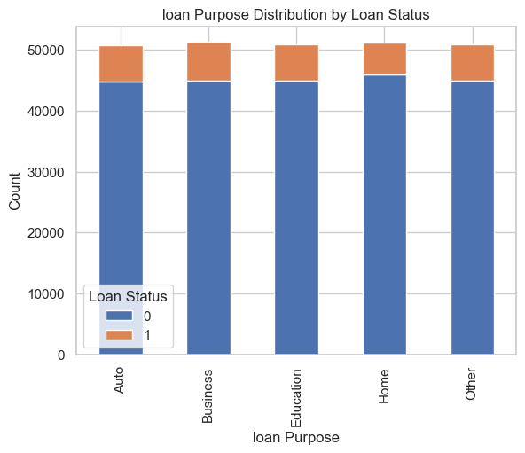

</div>

</div>

<div id="43ca528f-778a-4adf-9941-5028256f15c3" class="cell markdown"
markdown="1">

#### Statut du pret par Objectif d'emploi

Nous pouvons constater que la proportion de prêts approuvés pour par
type objectif du pret est plus élevé. que les prêts refusés

</div>

<div id="76066e06" class="cell code" markdown="1" execution_count="79">

``` python
counts = data["HasMortgage"].value_counts()

counts = data.groupby(["HasMortgage", "Default"]).size().unstack(fill_value=0)
plt.figure(figsize=(5, 3))
counts.plot(kind="bar", stacked=True)
plt.xlabel("HasMortgage")
plt.ylabel("Count")
plt.title("Has Mortgage Distribution by Loan Status")
plt.legend(title="Loan Status")
plt.show()
```

<div class="output display_data" markdown="1">

    <Figure size 500x300 with 0 Axes>

</div>

<div class="output display_data" markdown="1">

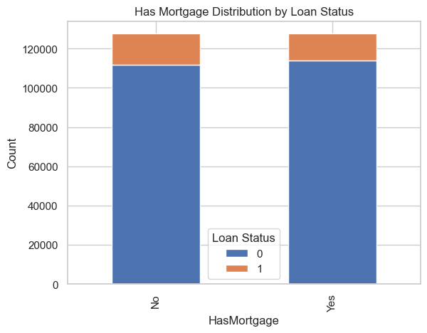

</div>

</div>

<div id="0f6361c7-8288-4895-a4b0-769e71cfbadf" class="cell markdown"
markdown="1">

#### Statut du pret par Indicateur de prêt hypothécaire

Nous pouvons constater que la proportion de prêts approuvés pour
(Indicateur de prêt hypothécaire) est plus élevé. que les prêts refusés

</div>

<div id="67f71181" class="cell code" markdown="1" execution_count="80">

``` python
data['LoanToIncomeRatio'] = data['LoanAmount']/data['Income']
data['FinancialRiskScore'] = data['CreditScore'] - data['LoanToIncomeRatio'] + (data['MonthsEmployed']/12)
```

</div>

<div id="d278b198-0e5f-4fe8-bc71-3c34e7148b19" class="cell markdown"
markdown="1">

#### Loan To Income Ratio

The loan-to-income ratio is a financial metric that represents the
proportion of a person's income that goes towards repaying a loan. It is
often used by lenders to assess a borrower's ability to manage their
debt. A higher loan-to-income ratio could indicate higher financial
stress.

#### Financial Risk Score

The idea is that a higher credit score and longer employment duration
might contribute positively to the financial risk score, while a higher
loan-to-income ratio might contribute negatively

</div>

<div id="eecf4bbe" class="cell code" markdown="1" execution_count="81">

``` python
avg_rembourse = data.loc[data['Default'] == 0, 'LoanToIncomeRatio'].median()
avg_non_rembourse = data.loc[data['Default'] == 1, 'LoanToIncomeRatio'].median()

plt.figure(figsize=(8, 4))

sns.kdeplot(data.loc[data['Default'] == 0, 'LoanToIncomeRatio'], label='Remboursé == 0')
sns.kdeplot(data.loc[data['Default'] == 1, 'LoanToIncomeRatio'], label='Remboursé == 1')

plt.xlabel('RatioEmpruntSurRevenu')
plt.ylabel('Densité')
plt.title('Distribution de %s' % 'RatioEmpruntSurRevenu')
plt.legend()

print('La corrélation entre %s et la CIBLE est %0.4f' % ('RatioEmpruntSurRevenu', data['Default'].corr(data['LoanToIncomeRatio'])))

print('Valeur médiane pour les prêts non remboursés = %0.4f' % avg_non_rembourse)
print('Valeur médiane pour les prêts remboursés = %0.4f' % avg_rembourse)
```

<div class="output stream stdout" markdown="1">

    La corrélation entre RatioEmpruntSurRevenu et la CIBLE est 0.1790
    Valeur médiane pour les prêts non remboursés = 2.0499
    Valeur médiane pour les prêts remboursés = 1.4956

</div>

<div class="output display_data" markdown="1">

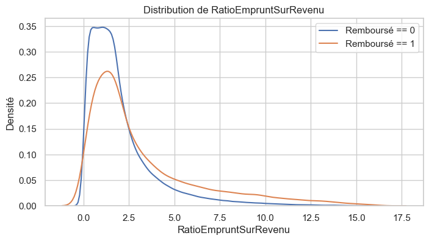

</div>

</div>

<div id="f62be73b" class="cell markdown" markdown="1">

le graphique de l'estimation de la densité du noyau (KDE) montre que les
lignes sont asymétriques vers la gauche et se chevauchent, ce qui
suggère que la distribution de la variable "LoanToIncomeRatio" est
différente pour les prêts qui ont été remboursés ("Défaut == 0") par
rapport aux prêts qui n'ont pas été remboursés ("Défaut == 1").

les lignes sont inclinées vers la gauche, cela signifie que la majorité
des valeurs de "LoanToIncomeRatio" sont concentrées dans la partie
inférieure. Dans le contexte des remboursements de prêts, cela pourrait
indiquer que les prêts avec des ratios prêt/revenu inférieurs sont plus
fréquents dans l'ensemble de données.

</div>

<div id="d8ffe4d3" class="cell code" markdown="1" execution_count="82">

``` python
avg_rembourse = data.loc[data['Default'] == 0, 'FinancialRiskScore'].median()
avg_non_rembourse = data.loc[data['Default'] == 1, 'FinancialRiskScore'].median()

plt.figure(figsize=(8, 4))

sns.kdeplot(data.loc[data['Default'] == 0, 'FinancialRiskScore'], label='Remboursé == 0')
sns.kdeplot(data.loc[data['Default'] == 1, 'FinancialRiskScore'], label='Remboursé == 1')

plt.xlabel('ScoreRisqueFinancier')
plt.ylabel('Densité')
plt.title('Distribution de %s' % 'ScoreRisqueFinancier')
plt.legend()

print('La corrélation entre %s et la CIBLE est %0.4f' % ('ScoreRisqueFinancier',  data['Default'].corr(data['FinancialRiskScore'])))
print('Valeur médiane pour les prêts non remboursés = %0.4f' % avg_non_rembourse)
print('Valeur médiane pour les prêts remboursés = %0.4f' % avg_rembourse)
```

<div class="output stream stdout" markdown="1">

    La corrélation entre ScoreRisqueFinancier et la CIBLE est -0.0384
    Valeur médiane pour les prêts non remboursés = 553.8528
    Valeur médiane pour les prêts remboursés = 579.5443

</div>

<div class="output display_data" markdown="1">

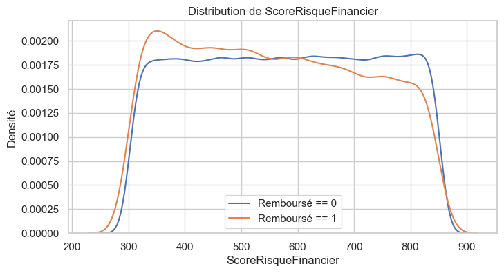

</div>

</div>

<div id="133ce4d9" class="cell markdown" markdown="1">

Coefficient de corrélation :

La corrélation entre 'FinancialRiskScore' et la variable 'TARGET' est de
-0,0384. Cette corrélation négative faible suggère une relation négative
légère entre le score de risque financier et la probabilité de défaut de
prêt. À mesure que le 'FinancialRiskScore' diminue, il y a une légère
tendance à ce que la variable cible (remboursé ou non remboursé)
augmente, et vice versa. Valeurs médianes :

La médiane de 'FinancialRiskScore' pour les prêts non remboursés est de
553,8528, tandis que la médiane pour les prêts remboursés est de
579,5443. La différence entre les valeurs médianes indique qu'en
moyenne, les prêts non remboursés ont un score de risque financier
légèrement inférieur par rapport aux prêts remboursés. En résumé :

Corrélation négative faible : La corrélation négative suggère une
tendance subtile où les scores de risque financier plus bas sont
associés à une probabilité légèrement plus élevée de défaut de prêt.

Comparaison des médianes : La médiane légèrement inférieure du
'FinancialRiskScore' pour les prêts non remboursés soutient l'idée que
les prêts avec des scores de risque financier plus bas sont plus
fréquents parmi les défauts.

</div>

<div id="bd5458cb" class="cell markdown" markdown="1">

# Gestion des données manquantes

</div>

<div id="d664cdc9" class="cell code" markdown="1" execution_count="83">

``` python
data.isnull().sum()
```

<div class="output execute_result" markdown="1" execution_count="83">

    LoanID                0
    Age                   0
    Income                0
    LoanAmount            0
    CreditScore           0
    MonthsEmployed        0
    NumCreditLines        0
    InterestRate          0
    LoanTerm              0
    DTIRatio              0
    Education             0
    EmploymentType        0
    MaritalStatus         0
    HasMortgage           0
    HasDependents         0
    LoanPurpose           0
    HasCoSigner           0
    Default               0
    LoanToIncomeRatio     0
    FinancialRiskScore    0
    dtype: int64

</div>

</div>

<div id="08277365-9447-4b9c-98ff-9b8c683d4690" class="cell markdown"
markdown="1">

#### Il n' ya pas de donnees null

</div>

<div id="38df3f6a" class="cell code" markdown="1" execution_count="84">

``` python
data.isna().sum()
```

<div class="output execute_result" markdown="1" execution_count="84">

    LoanID                0
    Age                   0
    Income                0
    LoanAmount            0
    CreditScore           0
    MonthsEmployed        0
    NumCreditLines        0
    InterestRate          0
    LoanTerm              0
    DTIRatio              0
    Education             0
    EmploymentType        0
    MaritalStatus         0
    HasMortgage           0
    HasDependents         0
    LoanPurpose           0
    HasCoSigner           0
    Default               0
    LoanToIncomeRatio     0
    FinancialRiskScore    0
    dtype: int64

</div>

</div>

<div id="d3c1d782-9d46-48ff-a0d1-9367ec0946f6" class="cell markdown"
markdown="1">

#### pas de donnees manquantes

L'absence de valeurs manquantes indique que notre ensemble de données
est complet et que nous disposons d'informations pour toutes les
observations et variables.

</div>

<div id="0042e54e" class="cell markdown" markdown="1">

### Segmentation des données

</div>

<div id="bb344dd4" class="cell code" markdown="1" execution_count="85">

``` python
# segmentation par âge
bins = [18, 30, 45, 60, 100]
labels = ['18-30', '30-45', '45-60', '60+']
data['AgeGroup'] = pd.cut(data['Age'], bins=bins, labels=labels)
```

</div>

<div id="79980a3d" class="cell code" markdown="1" execution_count="86">

``` python
# segmentation par revenu
bins = [0, 50000, 100000, 150000, 200000]
labels = ['0-50k', '50k-100k', '100k-150k', '150k+']
data['IncomeGroup'] = pd.cut(data['Income'], bins=bins, labels=labels)
```

</div>

<div id="411e58e9" class="cell code" markdown="1" execution_count="87">

``` python
# segmentation par score de crédit
bins = [0, 500, 700, 850]
labels = ['0-500', '500-700', '700-850']
data['CreditScoreGroup'] = pd.cut(data['CreditScore'], bins=bins, labels=labels)
```

</div>

<div id="226ebd57" class="cell code" markdown="1" execution_count="88">

``` python
# segmentation par durée du prêt
bins = [0, 12, 24, 60]
labels = ['0-12', '12-24', '24-60']
data['LoanTermGroup'] = pd.cut(data['LoanTerm'], bins=bins, labels=labels)
```

</div>

<div id="dce87f42" class="cell code" markdown="1" execution_count="89">

``` python
data
```

<div class="output execute_result" markdown="1" execution_count="89">

                LoanID  Age  Income  LoanAmount  CreditScore  MonthsEmployed  \
    0       I38PQUQS96   56   85994       50587          520              80   
    1       HPSK72WA7R   69   50432      124440          458              15   
    2       C1OZ6DPJ8Y   46   84208      129188          451              26   
    3       V2KKSFM3UN   32   31713       44799          743               0   
    4       EY08JDHTZP   60   20437        9139          633               8   
    ...            ...  ...     ...         ...          ...             ...   
    255342  8C6S86ESGC   19   37979      210682          541             109   
    255343  98R4KDHNND   32   51953      189899          511              14   
    255344  XQK1UUUNGP   56   84820      208294          597              70   
    255345  JAO28CPL4H   42   85109       60575          809              40   
    255346  ZTH91CGL0B   62   22418       18481          636             113   

            NumCreditLines  InterestRate  LoanTerm  DTIRatio  ... HasDependents  \
    0                    4         15.23        36      0.44  ...           Yes   
    1                    1          4.81        60      0.68  ...            No   
    2                    3         21.17        24      0.31  ...           Yes   
    3                    3          7.07        24      0.23  ...            No   
    4                    4          6.51        48      0.73  ...           Yes   
    ...                ...           ...       ...       ...  ...           ...   
    255342               4         14.11        12      0.85  ...            No   
    255343               2         11.55        24      0.21  ...            No   
    255344               3          5.29        60      0.50  ...           Yes   
    255345               1         20.90        48      0.44  ...           Yes   
    255346               2          6.73        12      0.48  ...            No   

           LoanPurpose HasCoSigner Default LoanToIncomeRatio FinancialRiskScore  \
    0            Other         Yes       0          0.588262         526.078405   
    1            Other         Yes       0          2.467481         456.782519   
    2             Auto          No       1          1.534154         451.632513   
    3         Business          No       0          1.412638         741.587362   
    4             Auto          No       0          0.447179         633.219488   
    ...            ...         ...     ...               ...                ...   
    255342       Other          No       0          5.547329         544.536005   
    255343        Home          No       1          3.655208         508.511459   
    255344        Auto         Yes       0          2.455718         600.377615   
    255345       Other          No       0          0.711734         811.621599   
    255346   Education         Yes       0          0.824382         644.592284   

           AgeGroup  IncomeGroup  CreditScoreGroup  LoanTermGroup  
    0         45-60     50k-100k           500-700          24-60  
    1           60+     50k-100k             0-500          24-60  
    2         45-60     50k-100k             0-500          12-24  
    3         30-45        0-50k           700-850          12-24  
    4         45-60        0-50k           500-700          24-60  
    ...         ...          ...               ...            ...  
    255342    18-30        0-50k           500-700           0-12  
    255343    30-45     50k-100k           500-700          12-24  
    255344    45-60     50k-100k           500-700          24-60  
    255345    30-45     50k-100k           700-850          24-60  
    255346      60+        0-50k           500-700           0-12  

    [255347 rows x 24 columns]

</div>

</div>

<div id="a6168583" class="cell code" markdown="1" execution_count="90">

``` python
plt.figure(figsize=(5, 3))
sns.histplot(data['AgeGroup'], kde=False, color='skyblue')
plt.title('Distribution des groupes d\'âge')
plt.xlabel('Groupes d\'âge')
plt.ylabel('Fréquence')
plt.show()
```

<div class="output display_data" markdown="1">

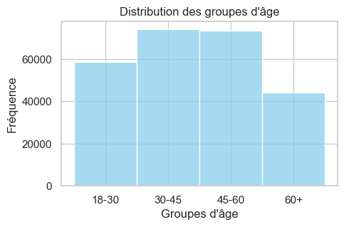

</div>

</div>

<div id="13f9691f-62b0-4781-a223-a3b132e3bb40" class="cell markdown"
markdown="1">

L'histogramme montre que l'âge des demandeurs de prêts est
principalement concentré entre 30 et 60 ans.

</div>

<div id="7af41aeb" class="cell code" markdown="1" execution_count="91">

``` python
plt.figure(figsize=(5, 3))
sns.histplot(data['IncomeGroup'], kde=False, color='skyblue')
plt.title('Distribution des groupes de revenue')
plt.xlabel('Groupes de revenue')
plt.ylabel('Fréquence')
plt.show()
```

<div class="output display_data" markdown="1">

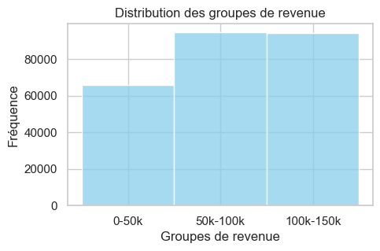

</div>

</div>

<div id="d14d2cf8-a3c0-4359-8559-eecb46563c71" class="cell markdown"
markdown="1">

L'histogramme montre que le revenu des demandeurs de prêts est
principalement concentré entre 50000\$ et 150000

</div>

<div id="3a1dac0a" class="cell code" markdown="1" execution_count="92">

``` python
plt.figure(figsize=(5, 3))
sns.histplot(data['CreditScoreGroup'], kde=False, color='skyblue')
plt.title('Distribution des groupes de Cote de crédit')
plt.xlabel('Groupes de Cote de crédit')
plt.ylabel('Fréquence')
plt.show()
```

<div class="output display_data" markdown="1">


</div>

</div>

<div id="8d783c5b-44cc-4b04-ae83-c2bfd339a4c4" class="cell markdown"
markdown="1">

La distribution des scores de crédit dans l'ensemble de données suit une
distribution normale, avec une fréquence plus élevée d'individus ayant
des scores de crédit dans (0 et 700). Lorsque le score de crédit
s'écarte de cette fourchette, la fréquence diminue, ce qui indique que
les scores de crédit extrêmes sont moins fréquents dans l'ensemble de
données.

</div>

<div id="e5dad5bc" class="cell code" markdown="1" execution_count="93">

``` python
plt.figure(figsize=(5, 3))
sns.histplot(data['LoanTermGroup'], kde=False, color='skyblue')
plt.title('Distribution des groupes de la Durée du prêt en mois')
plt.xlabel('Groupes de la Durée du prêt en mois')
plt.ylabel('Fréquence')
plt.show()
```

<div class="output display_data" markdown="1">


</div>

</div>

<div id="f1fab4ce-79d8-4eb8-aa4e-6ef82e9116d8" class="cell markdown"
markdown="1">

La distribution des durée de pret dans l'ensemble de données suit une
distribution anormale, avec une fréquence plus élevée d'individus ayant
des scores de crédit dans plus que 24. Lorsque la durée de pret diminue,
la fréquence augmant,

</div>

<div id="4145968c" class="cell code" markdown="1" execution_count="94">

``` python

# Count the number of individuals in each age group with different loan statuses
counts = data.groupby(["AgeGroup", "Default"]).size().unstack(fill_value=0)

# Create a stacked bar plot to visualize the age intervals with loan statuses
counts.plot(kind="bar", stacked=True)
plt.xlabel("Age Group")
plt.ylabel("Count")
plt.title("Age Distribution by Loan Status")
plt.legend(title="Loan Status")
plt.show()
```

<div class="output display_data" markdown="1">

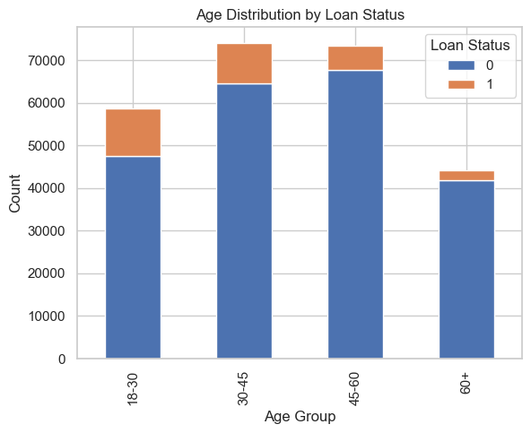

</div>

</div>

<div id="7fd96004" class="cell markdown" markdown="1">

Nous pouvons constater que la proportion de prêts approuvés par age du
demandeur est plus elevé par rapport proportion de prêts refusés

</div>

<div id="d35249a2" class="cell code" markdown="1" execution_count="95">

``` python
data = data.drop(columns=['LoanID', 'Education'])
```

</div>

<div id="238adfa2-1b9b-4655-9254-707667667694" class="cell markdown"
markdown="1">

### Nous pouvons supprime le loanID et Education parce que il n'on pas d'influance sur la variable cible

</div>

<div id="2cbc3778" class="cell markdown" markdown="1">

# Corrélations entre variables : [corrélations-entre-variables-]

</div>

<div id="60e63f7e" class="cell code" markdown="1" execution_count="96">

``` python
data = data.drop(columns=["IncomeGroup","CreditScoreGroup","AgeGroup","LoanTermGroup"])
data['MaritalStatus'] = data['MaritalStatus'].map({'Divorced': 0, 'Married': 1, 'Single': 2})
data['EmploymentType'] = data['EmploymentType'].map({'Unemployed': 0, 'Full-time': 1, 'Self-employed': 2, 'Part-time': 3})
data['HasMortgage'] = data['HasMortgage'].map({'No': 0, 'Yes': 1})
data['HasDependents'] = data['HasDependents'].map({'No': 0, 'Yes': 1})
data['LoanPurpose'] = data['LoanPurpose'].map({'Auto': 0, 'Business': 1, 'Education': 2, 'Home': 3, 'Other': 4})
data['HasCoSigner'] = data['HasCoSigner'].map({'No': 0, 'Yes': 1})
```

</div>

<div id="0e00226a" class="cell code" markdown="1" execution_count="97"
scrolled="true">

``` python
data
```

<div class="output execute_result" markdown="1" execution_count="97">

            Age  Income  LoanAmount  CreditScore  MonthsEmployed  NumCreditLines  \
    0        56   85994       50587          520              80               4   
    1        69   50432      124440          458              15               1   
    2        46   84208      129188          451              26               3   
    3        32   31713       44799          743               0               3   
    4        60   20437        9139          633               8               4   
    ...     ...     ...         ...          ...             ...             ...   
    255342   19   37979      210682          541             109               4   
    255343   32   51953      189899          511              14               2   
    255344   56   84820      208294          597              70               3   
    255345   42   85109       60575          809              40               1   
    255346   62   22418       18481          636             113               2   

            InterestRate  LoanTerm  DTIRatio  EmploymentType  MaritalStatus  \
    0              15.23        36      0.44               1              0   
    1               4.81        60      0.68               1              1   
    2              21.17        24      0.31               0              0   
    3               7.07        24      0.23               1              1   
    4               6.51        48      0.73               0              0   
    ...              ...       ...       ...             ...            ...   
    255342         14.11        12      0.85               1              1   
    255343         11.55        24      0.21               3              0   
    255344          5.29        60      0.50               2              1   
    255345         20.90        48      0.44               3              2   
    255346          6.73        12      0.48               0              0   

            HasMortgage  HasDependents  LoanPurpose  HasCoSigner  Default  \
    0                 1              1            4            1        0   
    1                 0              0            4            1        0   
    2                 1              1            0            0        1   
    3                 0              0            1            0        0   
    4                 0              1            0            0        0   
    ...             ...            ...          ...          ...      ...   
    255342            0              0            4            0        0   
    255343            0              0            3            0        1   
    255344            1              1            0            1        0   
    255345            1              1            4            0        0   
    255346            1              0            2            1        0   

            LoanToIncomeRatio  FinancialRiskScore  
    0                0.588262          526.078405  
    1                2.467481          456.782519  
    2                1.534154          451.632513  
    3                1.412638          741.587362  
    4                0.447179          633.219488  
    ...                   ...                 ...  
    255342           5.547329          544.536005  
    255343           3.655208          508.511459  
    255344           2.455718          600.377615  
    255345           0.711734          811.621599  
    255346           0.824382          644.592284  

    [255347 rows x 18 columns]

</div>

</div>

<div id="e39c103e-d8db-4d3c-acf0-77fbacf79a79" class="cell code"
markdown="1" execution_count="98">

``` python
data1 = data
data2 = data1.drop(columns=["MaritalStatus", "HasMortgage", "HasDependents", "LoanPurpose", "HasCoSigner"])
correlation_matrix = data2.corr()
# Créer une heatmap pour visualiser la corrélation
plt.figure(figsize=(10, 5))
sns.heatmap(correlation_matrix, annot=True, cmap='coolwarm', fmt=".2f")
plt.title('Matrice de corrélation des variables numerique')
plt.show()
```

<div class="output display_data" markdown="1">

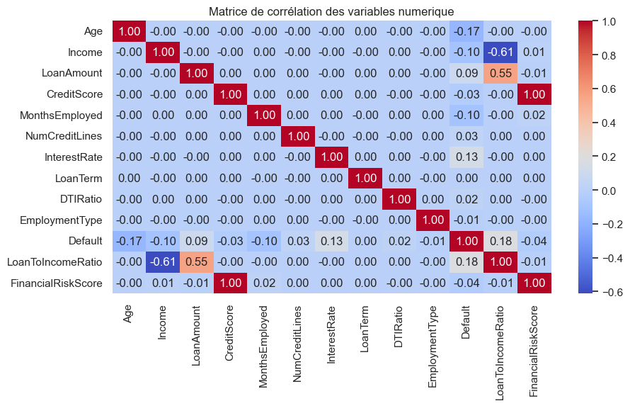

</div>

</div>

<div id="26941d6a-4f2b-4730-b521-db5515eb09bb" class="cell markdown"
markdown="1">

La variable la plus fortement corrélée avec "Default" (le défaut) est
"CreditScore" avec une corrélation négative de -0.034166. Cela signifie
que plus le score de crédit est élevé, moins il est probable qu'il y ait
un défaut.

Il y a également une corrélation positive notable entre "Default" et
"LoanToIncomeRatio" (0.178963). Cela suggère qu'une augmentation du
ratio prêt sur revenu est associée à une augmentation de la probabilité
de défaut.

"LoanAmount" et "LoanToIncomeRatio" présentent une corrélation
significative de 0.554730, ce qui indique une relation positive entre le
montant du prêt et le ratio prêt sur revenu.

"CreditScore" et "FinancialRiskScore" ont une corrélation extrêmement
élevée de 0.999741, ce qui suggère qu'ils sont presque identiques ou
fortement liés. Cela pourrait être dû à une redondance dans les données
ou à une construction de variables.

Il y a une corrélation négative modérée entre "Income" et
"LoanToIncomeRatio" (-0.613392), indiquant que des revenus plus élevés
sont associés à un ratio prêt sur revenu plus faible.

</div>

<div id="7a2e39ef" class="cell code" markdown="1" execution_count="99">

``` python
correlation_matrix = data.corr()
# Créer une heatmap pour visualiser la corrélation
plt.figure(figsize=(15, 5))
sns.heatmap(correlation_matrix, annot=True, cmap='coolwarm', fmt=".2f")
plt.title('Matrice de corrélation')
plt.show()
```

<div class="output display_data" markdown="1">

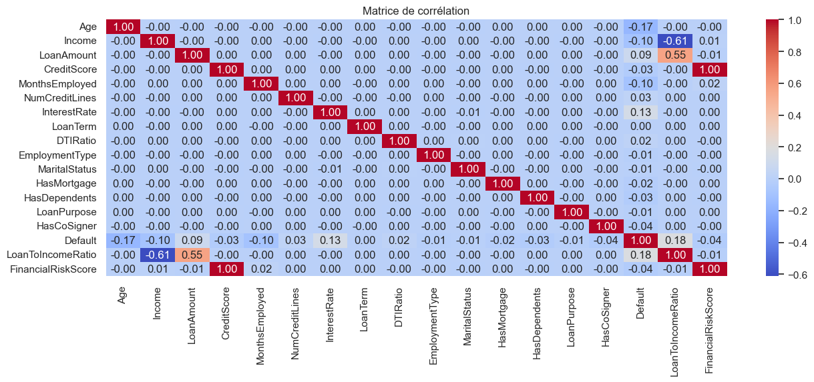

</div>

</div>

<div id="6d28b7a8" class="cell markdown" markdown="1">

### Corrélations importantes avec la variable cible (Default) : [corrélations-importantes-avec-la-variable-cible-default-]

-   Age a une corrélation négative modérée avec Default (-0.26). Cela
    suggère que les plus jeunes ont tendance à avoir une probabilité de
    défaut légèrement plus élevée.

-   Income a une corrélation négative modérée avec Default (-0.15). Cela
    suggère que des revenus plus élevés sont associés à une probabilité
    de défaut légèrement plus faible.

-   InterestRate a une corrélation positive importante avec Default
    (0.20). Cela indique que des taux d'intérêt plus élevés sont
    associés à une probabilité de défaut plus élevée.

    #### Corrélations intéressantes entre autres variables : [corrélations-intéressantes-entre-autres-variables-]

-   Il y a une corrélation positive modérée entre NumCreditLines et
    Default (0.04). Cela peut suggérer que ceux qui ont un plus grand
    nombre de lignes de crédit ont une probabilité de défaut légèrement
    plus élevée.

-   Il y a une corrélation positive modérée entre MonthsEmployed et
    Default (-0.15). Cela peut suggérer que les personnes employées
    depuis plus longtemps ont une probabilité de défaut légèrement plus
    faible.

    #### Corrélations faibles : [corrélations-faibles-]

-La plupart des autres corrélations sont relativement faibles, ce qui
indique une faible corrélation linéaire entre ces paires de variables.

</div>

<div id="3cdf6362-5c08-4d8e-b67e-fa8d6840d07a" class="cell markdown"
markdown="1">

# \|\| Sélection des caractéristiques et création du modèle [-sélection-des-caractéristiques-et-création-du-modèle]

</div>

<div id="9fa92385-6bf2-471e-8699-f122e18c5a51" class="cell markdown"
markdown="1">

### a) Identifiez et extrayez les caractéristiques pertinentes des données. [a-identifiez-et-extrayez-les-caractéristiques-pertinentes-des-données]

</div>

<div id="4185b781-a11b-43c0-8252-0244d742b564" class="cell code"
markdown="1" execution_count="100">

``` python
# Choisissons un seuil de corrélation
seuil = 0.01

# Sélectionnons les caractéristiques fortement corrélées avec la variable cible 'Default'
correlation_avec_cible = correlation_matrix['Default'].abs()
caracteristiques_pertinentes = correlation_avec_cible[correlation_avec_cible >= seuil].index

# Extrayez les caractéristiques pertinentes
data = data[caracteristiques_pertinentes].drop(columns=["LoanToIncomeRatio", "FinancialRiskScore"])
data
```

<div class="output execute_result" markdown="1" execution_count="100">

            Age  Income  LoanAmount  CreditScore  MonthsEmployed  NumCreditLines  \
    0        56   85994       50587          520              80               4   
    1        69   50432      124440          458              15               1   
    2        46   84208      129188          451              26               3   
    3        32   31713       44799          743               0               3   
    4        60   20437        9139          633               8               4   
    ...     ...     ...         ...          ...             ...             ...   
    255342   19   37979      210682          541             109               4   
    255343   32   51953      189899          511              14               2   
    255344   56   84820      208294          597              70               3   
    255345   42   85109       60575          809              40               1   
    255346   62   22418       18481          636             113               2   

            InterestRate  DTIRatio  HasMortgage  HasDependents  LoanPurpose  \
    0              15.23      0.44            1              1            4   
    1               4.81      0.68            0              0            4   
    2              21.17      0.31            1              1            0   
    3               7.07      0.23            0              0            1   
    4               6.51      0.73            0              1            0   
    ...              ...       ...          ...            ...          ...   
    255342         14.11      0.85            0              0            4   
    255343         11.55      0.21            0              0            3   
    255344          5.29      0.50            1              1            0   
    255345         20.90      0.44            1              1            4   
    255346          6.73      0.48            1              0            2   

            HasCoSigner  Default  
    0                 1        0  
    1                 1        0  
    2                 0        1  
    3                 0        0  
    4                 0        0  
    ...             ...      ...  
    255342            0        0  
    255343            0        1  
    255344            1        0  
    255345            0        0  
    255346            1        0  

    [255347 rows x 13 columns]

</div>

</div>

<div id="0f4396a3-7aee-4580-828f-9b695af04842" class="cell markdown"
markdown="1">

D'apres la matrice de correlation en peux dire que les caracteristiques
pertinentes san les suivantes:

-   Age
-   Income
-   LoanAmount
-   CreditScore
-   MonthsEmployed
-   NumCreditLines
-   InterestRate
-   DTIRatio
-   HasMortgage
-   HasDependents
-   LoanPurpose
-   HasCoSigner

</div>

<div id="f9c992a6-6d31-4c0f-97b4-e5c760b1de8a" class="cell markdown"
markdown="1">

### b) choix des modèles de prédictione

</div>

<div id="0db68570-8b80-4055-8ed9-ee4a6eb1571a" class="cell markdown"
markdown="1">

#### Régression Logistique-

La régression logistique est une méthode classique pour la modélisation
de problèmes de classification binaire. Son caractère explicite et
interprétable en fait un choix pertinent pour comprendre l'influence de
chaque caractéristique sur la probabilité de défaut

#### Arbre de Décision

-   Les arbres de décision sont des modèles intuitifs qui peuvent
    capturer des relations non linéaires dans les données. En utilisant
    des seuils sur les caractéristiques, les arbres de décision sont
    capables de modéliser des schémas complexes, ce qui peut être
    crucial pour notre problème.

#### Forêt Aléatoire

-   La forêt aléatoire est une extension des arbres de décision,
    combinant plusieurs arbres pour réduire le sur ajustement et
    améliorer la précision. Cette approche est particulièrement
    puissante pour capturer des tendances subtiles et pour gérer des
    ensembles de données complexes.exes.

</div>

<div id="f4b4f553-2f0a-458c-aee4-4a89ccf1c145" class="cell markdown"
markdown="1">

# III. Choix de l'algorithme d'apprentissage automatique [iii-choix-de-lalgorithme-dapprentissage-automatique]

</div>

<div id="ab6cfca5-45fa-4b14-a136-97b504e09007" class="cell markdown"
markdown="1">

### a. Sélection des algorithmes [a-sélection-des-algorithmes]

</div>

<div id="e84ad115-8dac-4079-9fee-5467dcb9be10" class="cell code"
markdown="1" execution_count="101">

``` python
logistic_regression_model = LogisticRegression(random_state=42)
modele_arbre_decision = DecisionTreeClassifier(random_state=42)
modele_foret_aleatoire = RandomForestClassifier(random_state=42)
```

</div>

<div id="3b0867cc" class="cell markdown" markdown="1">

### b. Division des données [b-division-des-données]

</div>

<div id="bc37e368" class="cell code" markdown="1" execution_count="102">

``` python
X = data.drop(columns=['Default']) 
y = data['Default']

X_train, X_temp, y_train, y_temp = train_test_split(X, y, test_size=0.4, random_state=42)

X_val, X_test, y_val, y_test = train_test_split(X_temp, y_temp, test_size=0.5, random_state=42)
```

</div>

<div id="16eeb3b1-9906-402c-ab24-704c69cbb03f" class="cell markdown"
markdown="1">

### c. Entraînement et évaluation [c-entraînement-et-évaluation]

</div>

<div id="fe06fa03" class="cell markdown" markdown="1">

#### Modele de la regression Logistique

</div>

<div id="ca9ebf73" class="cell code" markdown="1" execution_count="103">

``` python
logistic_regression_model.fit(X_train, y_train)
```

<div class="output execute_result" markdown="1" execution_count="103">

    LogisticRegression(random_state=42)

</div>

</div>

<div id="3af5dfa8-c635-4cad-ba00-fb22afe71830" class="cell code"
markdown="1" execution_count="104">

``` python
# Prédiction sur l'ensemble de validation
y_val_pred_lr = logistic_regression_model.predict(X_val)

# Calcul de la précision
print("Logistic Regression Accuracy on Validation Set:", accuracy_score(y_val, y_val_pred_lr))

y_test_pred_lr = logistic_regression_model.predict(X_test)
print("Logistic Regression Accuracy on Test Set:", accuracy_score(y_test, y_test_pred_lr))

print("\nLogistic Regression Classification Report on Test Set:")
print(classification_report(y_test, y_test_pred_lr))
```

<div class="output stream stdout" markdown="1">

    Logistic Regression Accuracy on Validation Set: 0.8836084513109714
    Logistic Regression Accuracy on Test Set: 0.8825141962012923

    Logistic Regression Classification Report on Test Set:
                  precision    recall  f1-score   support

               0       0.88      1.00      0.94     45070
               1       0.50      0.00      0.00      6000

        accuracy                           0.88     51070
       macro avg       0.69      0.50      0.47     51070
    weighted avg       0.84      0.88      0.83     51070

</div>

</div>

<div id="816f9977-a34a-4073-85a7-c6451ba6c219" class="cell markdown"
markdown="1">

Le modèle fait preuve d'une grande précision pour la classe 0, mais
éprouve des difficultés avec la classe 1, comme l'indiquent les faibles
taux de précision, de rappel et de score F1 pour la classe 1.

Le déséquilibre entre les classes (un grand nombre d'instances pour la
classe 0 et un plus petit nombre pour la classe 1) peut fausser les
mesures de précision. Dans les ensembles de données déséquilibrés, la
précision, le rappel et le score F1 pour la classe minoritaire
(classe 1) sont souvent plus instructifs.

</div>

<div id="37c77bcc-6a3b-4169-8081-f0e0698f6fb4" class="cell code"
markdown="1" execution_count="105">

``` python
y_pred_prob = logistic_regression_model.predict_proba(X_test)[:, 1]
y_pred_prob
```

<div class="output execute_result" markdown="1" execution_count="105">

    array([0.11040873, 0.02911237, 0.08252048, ..., 0.22433507, 0.10566581,
           0.1608846 ])

</div>

</div>

<div id="9337b40e-c9bb-44f6-81ab-32acd4dbf559" class="cell code"
markdown="1" execution_count="106">

``` python
from sklearn.metrics import roc_curve, roc_auc_score
fpr, tpr, thresholds = roc_curve(y_test, y_pred_prob)
```

</div>

<div id="2a68ec5c-874e-4ca0-90d2-b9da1e7b0c88" class="cell code"
markdown="1" execution_count="107">

``` python
plt.figure(figsize=(5, 4))
plt.plot(fpr, tpr, color='blue', lw=2, label='ROC curve')
plt.plot([0, 1], [0, 1], color='gray', linestyle='--', label='Random')
plt.xlabel('False Positive Rate (1 - Specificity)')
plt.ylabel('True Positive Rate (Sensitivity)')
plt.title('ROC Curve')
plt.legend()
plt.show()
```

<div class="output display_data" markdown="1">

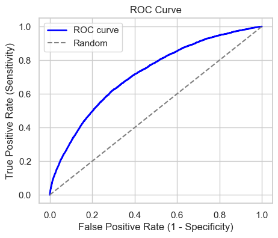

</div>

</div>

<div id="632e4c98-8eec-4e87-bd47-16b1f0c03597" class="cell code"
markdown="1" execution_count="108">

``` python
auc = roc_auc_score(y_test, y_pred_prob)
print(f'AUC: {auc:.2f}')
```

<div class="output stream stdout" markdown="1">

    AUC: 0.72

</div>

</div>

<div id="45e64004" class="cell markdown" markdown="1">

#### Model Decision Tree

</div>

<div id="1ff0737a" class="cell code" markdown="1" execution_count="109">

``` python
# Entraîner le modèle sur l'ensemble d'entraînement
modele_arbre_decision.fit(X_train, y_train)
```

<div class="output execute_result" markdown="1" execution_count="109">

    DecisionTreeClassifier(random_state=42)

</div>

</div>

<div id="dbd4142a-7c74-4077-b03a-df6c132d845c" class="cell code"
markdown="1" execution_count="110" scrolled="true">

``` python
y_val_pred_dt = modele_arbre_decision.predict(X_val)

# Évaluer le modèle sur l'ensemble de validation
print("Précision de l'arbre de décision sur l'ensemble de validation:", accuracy_score(y_val, y_val_pred_dt))

# Prédictions sur l'ensemble de test
y_test_pred_dt = modele_arbre_decision.predict(X_test)

# Évaluer le modèle sur l'ensemble de test
print("Précision de l'arbre de décision sur l'ensemble de test:", accuracy_score(y_test, y_test_pred_dt))

# Rapport de classification pour l'arbre de décision sur l'ensemble de test
print("\nRapport de classification pour l'arbre de décision sur l'ensemble de test:")
print(classification_report(y_test, y_test_pred_dt))
```

<div class="output stream stdout" markdown="1">

    Précision de l'arbre de décision sur l'ensemble de validation: 0.8034619828075741
    Précision de l'arbre de décision sur l'ensemble de test: 0.8021343254356765

    Rapport de classification pour l'arbre de décision sur l'ensemble de test:
                  precision    recall  f1-score   support

               0       0.89      0.88      0.89     45070
               1       0.20      0.22      0.21      6000

        accuracy                           0.80     51070
       macro avg       0.55      0.55      0.55     51070
    weighted avg       0.81      0.80      0.81     51070

</div>

</div>

<div id="edb27746-7cad-46bb-92f5-b2d2097f51c5" class="cell code"
markdown="1">

``` python
```

</div>

<div id="f4d46546-49db-4ac5-933e-5e14f12145a1" class="cell code"
markdown="1" execution_count="111">

``` python
y_pred_prob = modele_arbre_decision.predict_proba(X_test)[:, 1]
fpr, tpr, thresholds = roc_curve(y_test, y_pred_prob)

plt.figure(figsize=(5, 5))
plt.plot(fpr, tpr, color='blue', lw=2, label='ROC curve')
plt.plot([0, 1], [0, 1], color='gray', linestyle='--', label='Random')
plt.xlabel('False Positive Rate (1 - Specificity)')
plt.ylabel('True Positive Rate (Sensitivity)')
plt.title('ROC Curve')
plt.legend()
plt.show()

auc = roc_auc_score(y_test, y_pred_prob)
print(f'AUC: {auc:.2f}')
```

<div class="output display_data" markdown="1">

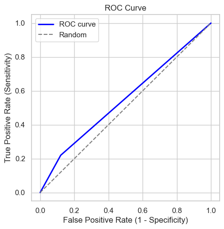

</div>

<div class="output stream stdout" markdown="1">

    AUC: 0.55

</div>

</div>

<div id="b4d9402c" class="cell markdown" markdown="1">

#### Modele Random Forest

</div>

<div id="78d0cf4c" class="cell code" markdown="1" execution_count="112">

``` python
# Entraîner le modèle sur l'ensemble d'entraînement
modele_foret_aleatoire.fit(X_train, y_train)
```

<div class="output execute_result" markdown="1" execution_count="112">

    RandomForestClassifier(random_state=42)

</div>

</div>

<div id="ac7c6e46-e75c-4919-a9d9-c4fab78ed6f6" class="cell code"
markdown="1" execution_count="113" scrolled="true">

``` python
y_val_pred_rf = modele_foret_aleatoire.predict(X_val)

# Évaluer le modèle sur l'ensemble de validation
print("Précision de la forêt aléatoire sur l'ensemble de validation:", accuracy_score(y_val, y_val_pred_rf))

# Prédictions sur l'ensemble de test
y_test_pred_rf = modele_foret_aleatoire.predict(X_test)

# Évaluer le modèle sur l'ensemble de test
print("Précision de la forêt aléatoire sur l'ensemble de test:", accuracy_score(y_test, y_test_pred_rf))

# Rapport de classification pour la forêt aléatoire sur l'ensemble de test
print("\nRapport de classification pour la forêt aléatoire sur l'ensemble de test:")
print(classification_report(y_test, y_test_pred_rf))
```

<div class="output stream stdout" markdown="1">

    Précision de la forêt aléatoire sur l'ensemble de validation: 0.8854882609802425
    Précision de la forêt aléatoire sur l'ensemble de test: 0.8845310358331702

    Rapport de classification pour la forêt aléatoire sur l'ensemble de test:
                  precision    recall  f1-score   support

               0       0.89      1.00      0.94     45070
               1       0.61      0.05      0.09      6000

        accuracy                           0.88     51070
       macro avg       0.75      0.52      0.51     51070
    weighted avg       0.85      0.88      0.84     51070

</div>

</div>

<div id="922e6ed5-cde3-4289-a3e4-e27b954aa412" class="cell markdown"
markdown="1">

-   La Forêt Aléatoire montre une précision élevée pour la classe 0,
    mais une performance plus faible pour la classe 1.
-   La classe 1 présente une précision relativement basse et un rappel
    très bas, suggérant que le modèle a du mal à identifier correctement
    les instances de la classe 1.
-   La classe 1 peut être la classe minoritaire

</div>

<div id="f09e6f8d-8e65-4ba8-97f3-8839b387c0c7" class="cell code"
markdown="1" execution_count="114">

``` python
y_pred_prob = modele_foret_aleatoire.predict_proba(X_test)[:, 1]
fpr, tpr, thresholds = roc_curve(y_test, y_pred_prob)

plt.figure(figsize=(5, 5))
plt.plot(fpr, tpr, color='blue', lw=2, label='ROC curve')
plt.plot([0, 1], [0, 1], color='gray', linestyle='--', label='Random')
plt.xlabel('False Positive Rate (1 - Specificity)')
plt.ylabel('True Positive Rate (Sensitivity)')
plt.title('ROC Curve')
plt.legend()
plt.show()

auc = roc_auc_score(y_test, y_pred_prob)
print(f'AUC: {auc:.2f}')
```

<div class="output display_data" markdown="1">

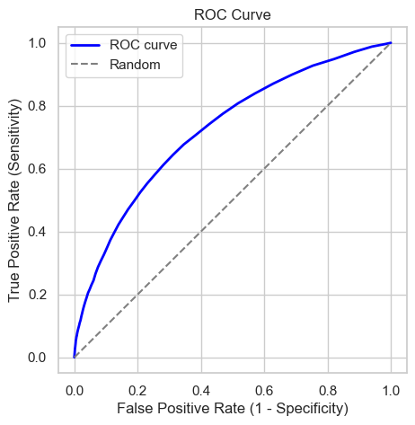

</div>

<div class="output stream stdout" markdown="1">

    AUC: 0.72

</div>

</div>

<div id="7e8ddd65" class="cell markdown" markdown="1">

# Comparaison entre les modele

</div>

<div id="036b87a4-a1f2-497d-8be3-996d1a93099b" class="cell markdown"
markdown="1">

## Conclusion sur la Performance des Modèles

### Régression Logistique : [régression-logistique-]

-   **Précision globale :**
    -   Ensemble de Validation : 0.88
    -   Ensemble de Test : 0.88
-   **Précision, Rappel, F1-Score pour la Classe 1 :**
    -   Précision : 0.50
    -   Rappel : 0.00
    -   F1-Score : 0.00

### Arbre de Décision : [arbre-de-décision-]

-   **Précision globale :**
    -   Ensemble de Validation : 0.80
    -   Ensemble de Test : 0.80
-   **Précision, Rappel, F1-Score pour la Classe 1 :**
    -   Précision : 0.20
    -   Rappel : 0.22
    -   F1-Score : 0.21

### Forêt Aléatoire : [forêt-aléatoire-]

-   **Précision globale :**
    -   Ensemble de Validation : 0.89
    -   Ensemble de Test : 0.88
-   **Précision, Rappel, F1-Score pour la Classe 1 :**
    -   Précision : 0.61
    -   Rappel : 0.05
    -   F1-Score : 0.09

### Conclusion : [conclusion-]

1.  **Régression Logistique :**
    -   Bonne précision globale mais difficultés à identifier
        correctement les instances de la Classe 1 (défaut de prêt).
    -   Performances limitées sur la classe minoritaire.
2.  **Arbre de Décision :**
    -   Précision modérée avec des défis similaires dans la prédiction
        correcte des instances de la Classe 1.
    -   Faible précision, rappel et F1-Score pour la Classe 1.
3.  **Forêt Aléatoire :**
    -   Haute précision sur la Classe 0 mais performances médiocres sur
        la Classe 1.
    -   Précision améliorée pour la Classe 1 par rapport à l'Arbre de
        nction des performances réelles sont recommandés. rs limités.

</div>

<div id="9d8a3588-c7c8-41c3-98de-7da6a286dfca" class="cell code"
markdown="1" execution_count="115">

``` python
# On remarque que les modèles présentent des défis dans la prédiction des instances de la Classe 1
# La gestion du déséquilibre des classes et l'exploration
# Examinon l'éséquilibre des classes
data['Default'].value_counts(normalize=True)
```

<div class="output execute_result" markdown="1" execution_count="115">

    Default
    0    0.883872
    1    0.116128
    Name: proportion, dtype: float64

</div>

</div>

<div id="0f5b7c22-2389-42b9-94a8-6f7d01d35f72" class="cell markdown"
markdown="1">

Les resultat prouve qu'il ya un déséquilibre entre les classes 0 et 1 ce
qui justifie les resultat du 3 models essayon de gerer ce déséquilibre
en utilisan la technique de

#### Suréchantillonnage (Over-sampling)

-   Cette technique génère des exemples synthétiques de la classe
    minoritaire pour équilibrer les deux classes.

</div>

<div id="0166a89b-b96d-4383-af8b-149021804fc5" class="cell code"
markdown="1" execution_count="116">

``` python
from sklearn.utils import resample

# Séparer les données en deux classes
class_0 = data[data['Default'] == 0]
class_1 = data[data['Default'] == 1]

# Suréchantillonner la classe minoritaire (Classe 1)
# 'replace=True' permet l'échantillonnage avec remplacement
# 'n_samples=len(class_0)' garantit que la taille des données suréchantillonnées correspond à celle de la classe majoritaire
# 'random_state' pour la reproductibilité
oversampled_class_1 = resample(class_1, replace=True, n_samples=len(class_0), random_state=42)

# Concaténer la classe minoritaire suréchantillonnée avec la classe majoritaire
oversampled_df = pd.concat([class_0, oversampled_class_1])

# Mélanger le DataFrame pour assurer la randomisation
data = oversampled_df.sample(frac=1, random_state=42).reset_index(drop=True)
```

</div>

<div id="1c61d811-0086-41b8-93f1-fa27cc48b232" class="cell code"
markdown="1" execution_count="117">

``` python
data['Default'].value_counts(normalize=True)
```

<div class="output execute_result" markdown="1" execution_count="117">

    Default
    1    0.5
    0    0.5
    Name: proportion, dtype: float64

</div>

</div>

<div id="2e5cbc7a-d633-495d-a1c8-58a9c34e88bd" class="cell markdown"
markdown="1">

On remarque qu'en a bien equilibrer notre classe minoritaire 1 avec la
class majoritaire 0

</div>

<div id="66514b50" class="cell markdown" markdown="1">

### En va essayer de test les donner equilibrer sue les 3 models

</div>

<div id="b01a30a2-6191-4b90-bb80-0d89acba4c60" class="cell code"
markdown="1" execution_count="118">

``` python
X = data.drop(columns=['Default'])  # Features
y = data['Default']  # Target variable

# Split the data into training and temporary sets
X_train, X_temp, y_train, y_temp = train_test_split(X, y, test_size=0.4, random_state=42)

# Split the temporary set into validation and test sets
X_val, X_test, y_val, y_test = train_test_split(X_temp, y_temp, test_size=0.5, random_state=42)
```

</div>

<div id="52b86fc6-c988-4f02-96d5-7827437718fd" class="cell code"
markdown="1" execution_count="119">

``` python
logistic_regression_model.fit(X_train, y_train)
y_test_pred_lr = logistic_regression_model.predict(X_test)
print("Logistic Regression Accuracy Score:", accuracy_score(y_test, y_test_pred_lr))
print(classification_report(y_test, y_test_pred_lr))
```

<div class="output stream stdout" markdown="1">

    Logistic Regression Accuracy Score: 0.6422384191054299
                  precision    recall  f1-score   support

               0       0.63      0.68      0.66     45314
               1       0.65      0.61      0.63     44964

        accuracy                           0.64     90278
       macro avg       0.64      0.64      0.64     90278
    weighted avg       0.64      0.64      0.64     90278

</div>

</div>

<div id="20f5f42a-7dbf-47bf-8bc7-8a0d818fb548" class="cell code"
markdown="1" execution_count="120">

``` python
y_pred_prob = logistic_regression_model.predict_proba(X_test)[:, 1]
fpr, tpr, thresholds = roc_curve(y_test, y_pred_prob)

plt.figure(figsize=(5, 5))
plt.plot(fpr, tpr, color='blue', lw=2, label='ROC curve')
plt.plot([0, 1], [0, 1], color='gray', linestyle='--', label='Random')
plt.xlabel('False Positive Rate (1 - Specificity)')
plt.ylabel('True Positive Rate (Sensitivity)')
plt.title('ROC Curve')
plt.legend()
plt.show()

auc = roc_auc_score(y_test, y_pred_prob)
print(f'AUC: {auc:.2f}')
```

<div class="output display_data" markdown="1">

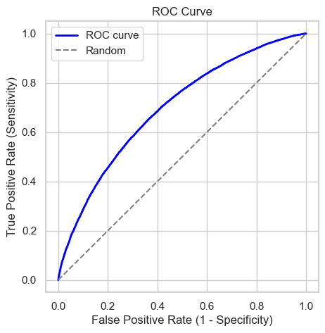

</div>

<div class="output stream stdout" markdown="1">

    AUC: 0.70

</div>

</div>

<div id="aa9bf281-4378-441b-9692-4fe3cc7fed65" class="cell code"
markdown="1" execution_count="121">

``` python
modele_arbre_decision.fit(X_train, y_train)
y_test_pred_ad = modele_arbre_decision.predict(X_test)
print("Decision Tree Accuracy Score:", accuracy_score(y_test, y_test_pred_ad))
print(classification_report(y_test, y_test_pred_ad))
```

<div class="output stream stdout" markdown="1">

    Decision Tree Accuracy Score: 0.9158045149427324
                  precision    recall  f1-score   support

               0       0.99      0.84      0.91     45314
               1       0.86      0.99      0.92     44964

        accuracy                           0.92     90278
       macro avg       0.93      0.92      0.92     90278
    weighted avg       0.93      0.92      0.92     90278

</div>

</div>

<div id="0bc944c2-fac8-4618-98f9-9dcc21607598" class="cell code"
markdown="1" execution_count="122">

``` python
y_pred_prob = modele_arbre_decision.predict_proba(X_test)[:, 1]
fpr, tpr, thresholds = roc_curve(y_test, y_pred_prob)

plt.figure(figsize=(5, 5))
plt.plot(fpr, tpr, color='blue', lw=2, label='ROC curve')
plt.plot([0, 1], [0, 1], color='gray', linestyle='--', label='Random')
plt.xlabel('False Positive Rate (1 - Specificity)')
plt.ylabel('True Positive Rate (Sensitivity)')
plt.title('ROC Curve')
plt.legend()
plt.show()

auc = roc_auc_score(y_test, y_pred_prob)
print(f'AUC: {auc:.2f}')
```

<div class="output display_data" markdown="1">

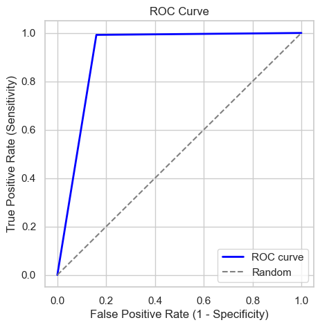

</div>

<div class="output stream stdout" markdown="1">

    AUC: 0.92

</div>

</div>

<div id="a943d514-64d5-470c-aa50-14a6e039b041" class="cell code"
markdown="1" execution_count="123">

``` python
modele_foret_aleatoire.fit(X_train, y_train)
y_test_pred_fa = modele_foret_aleatoire.predict(X_test)
print("Foret Aleatoire Accuracy Score:", accuracy_score(y_test, y_test_pred_fa))
print(classification_report(y_test, y_test_pred_fa))
```

<div class="output stream stdout" markdown="1">

    Foret Aleatoire Accuracy Score: 0.9738917565741376
                  precision    recall  f1-score   support

               0       0.99      0.96      0.97     45314
               1       0.96      0.99      0.97     44964

        accuracy                           0.97     90278
       macro avg       0.97      0.97      0.97     90278
    weighted avg       0.97      0.97      0.97     90278

</div>

</div>

<div id="abada934-5421-40e7-acca-32dff931a4c1" class="cell code"
markdown="1" execution_count="124">

``` python
y_pred_prob = modele_foret_aleatoire.predict_proba(X_test)[:, 1]
fpr, tpr, thresholds = roc_curve(y_test, y_pred_prob)

plt.figure(figsize=(5, 5))
plt.plot(fpr, tpr, color='blue', lw=2, label='ROC curve')
plt.plot([0, 1], [0, 1], color='gray', linestyle='--', label='Random')
plt.xlabel('False Positive Rate (1 - Specificity)')
plt.ylabel('True Positive Rate (Sensitivity)')
plt.title('ROC Curve')
plt.legend()
plt.show()

auc = roc_auc_score(y_test, y_pred_prob)
print(f'AUC: {auc:.2f}')
```

<div class="output display_data" markdown="1">

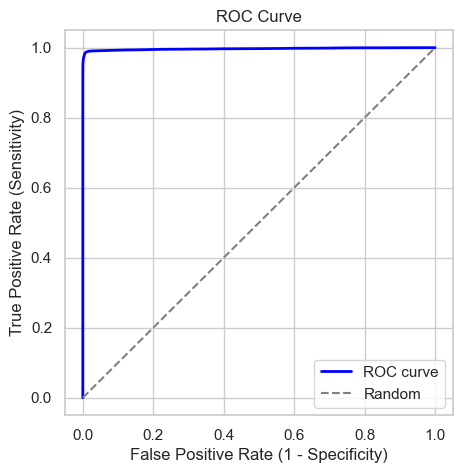

</div>

<div class="output stream stdout" markdown="1">

    AUC: 1.00

</div>

</div>

<div id="2f2d8342-a515-44c6-8745-fac224b4b5b3" class="cell markdown"
markdown="1">

### Observations : [observations-]

-   La Régression Logistique a obtenu une précision modérée par rapport
    à l'Arbre de Décision et à la Forêt Aléatoire.
-   L'Arbre de Décision montre de bonnes performances, mais il y a un
    léger déséquilibre de rappel pour la Classe 0.
-   La Forêt Aléatoire présente une excellente performance avec une
    précision, un rappel et un F1-Score équilibrés pour les deux
    classlonné.

</div>

<div id="53ffbcd8-e6e9-4a62-bffa-dcfa1c377a80" class="cell markdown"
markdown="1">

### Avant le Suréchantillonnage: donnees desiquilibrés

</div>

<div id="c1203c48-3bca-4385-b6be-c0f3fd00fb55" class="cell markdown"
markdown="1">

| Model               | Precision (Class 0) | Precision (Class 1) | Recall (Class 0) | Recall (Class 1) | F1-Score (Class 0) | F1-Score (Class 1) | Accuracy | Test AUC |
|--------|----------|----------|---------|---------|---------|---------|------|-----|
| Logistic Regression | 0.88                | 0.50                | 1.00             | 0.00             | 0.94               | 0.00               | 0.88     | 0.72     |
| Decision Tree       | 0.89                | 0.20                | 0.88             | 0.22             | 0.89               | 0.21               | 0.80     | 0.55     |
| Random Forest       | 0.89                | 0.61                | 1.00             | 0.05             | 0.94               | 0.09               | 0.88     | 0.72     |

et:\*\*

</div>

<div id="47bd85b4-5861-4abb-8cd4-740f88017f9d" class="cell markdown"
markdown="1">

### Apres le Suréchantillonnage: donnees equilibrés

</div>

<div id="fe86d2c1-fe8b-4f41-8af9-875767e9a253" class="cell markdown"
markdown="1">

| Model               | Accuracy | Precision (Class 0) | Precision (Class 1) | Recall (Class 0) | Recall (Class 1) | F1-Score (Class 0) | F1-Score (Class 1) | AUC  |
|----------|-----|----------|----------|--------|--------|----------|----------|-----|
| Logistic Regression | 0.64     | 0.63                | 0.65                | 0.68             | 0.61             | 0.66               | 0.63               | 0.70 |
| Decision Tree       | 0.92     | 0.99                | 0.86                | 0.84             | 0.99             | 0.91               | 0.92               | 0.92 |
| Random Forest       | 0.97     | 0.99                | 0.96                | 0.96             | 0.99             | 0.97               | 0.97               | 1.00 |

</div>

<div id="ed3036c6-4464-4ecd-ad28-a2024a21034c" class="cell markdown"
markdown="1">

# La Forêt Aléatoire semble être performante sur l'ensemble suréchantillonné. [la-forêt-aléatoire-semble-être-performante-sur-lensemble-suréchantillonné]

</div>

<div id="3d0af0a2-2a05-40e7-884a-2fdd1603fa9e" class="cell code"
markdown="1">

``` python
```

</div>

